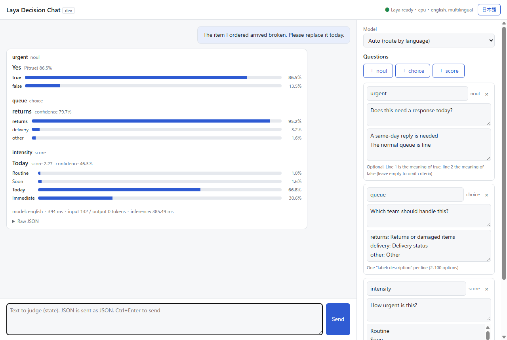

# Docker Containers for Evaluating Laya

[日本語](README.md) | **English**

A set of Docker containers for running and trying out [Laya](https://github.com/NandhaKishorM/laya), an open-source decision model (Apache-2.0), on your own machine.
It pairs Laya itself (`laya-serve` from the official `laya[serve]` package) with a signature-authenticated API and a decision chat you can use in the browser.

> [!NOTE]
> This repository is an unofficial evaluation environment. It is not affiliated with the Laya authors or the official project.



## What you can do

- Start Laya with a single `docker compose up` (NVIDIA GPU by default; CPU is also supported)
- Check how Laya decides by entering text and questions (yes/no, choice, rating scale) in the browser chat
- Call Laya from external applications through an HTTP API authenticated with HMAC signatures

## Documentation

| Document | Contents |
|---|---|
| [Deploying the Docker containers](docs/en/deploy.md) | Requirements, startup, switching between GPU and CPU, stopping and updating, settings, troubleshooting |
| [Using the chat](docs/en/chat.md) | Screen layout, writing questions, reading the results |
| [Using the API from external applications](docs/en/api.md) | Sample clients (Node.js / Python), endpoints, request and response formats, errors |
| [Authentication spec](docs/en/auth.md) | The HMAC signature + nonce scheme, and calling the API with curl |

Development records (Japanese only): [decisions](docs/decisions.md) ・ [port registry](docs/port-registry.md)

## Quick start

All you need is Docker (Compose v2.24 or later). Without a GPU, switch to CPU first as described in [step 3 of the deployment guide](docs/en/deploy.md#3-choose-gpu-or-cpu).

```sh
git clone https://github.com/polites-co-jp/laya-api.git
cd laya-api/laya-api-containers
cp .env.example .env
# Set API_AUTH_SECRET in .env to a random string of 32+ characters (e.g. openssl rand -base64 32)
docker compose up -d --build
```

| What | URL |
|---|---|
| Decision chat | <http://127.0.0.1:22301> |
| API | <http://127.0.0.1:22300> |

On first start, Laya downloads its weights (about 1.5 GB) from Hugging Face, so it takes a few minutes before it is ready.

## Architecture

```
Browser ──────> chat :22301 ──(signs and forwards)──┐
External app ──(HMAC signature)───────────────────> api :22300 ──> laya :8000 (not exposed to the host)
```

| Path | Contents |
|---|---|
| [apps/laya](apps/laya) | The Laya image (`laya[serve]==0.3.28`, with CUDA or CPU builds of torch) |
| [apps/api](apps/api) | The API that verifies signatures and forwards to Laya (Node.js / Fastify / TypeScript) |
| [apps/chat](apps/chat) | The decision chat for trying Laya (Japanese / English) |
| [apps/examples](apps/examples) | Sample clients for external applications (Node.js / Python, no dependencies) |
| [laya-api-containers](laya-api-containers) | docker compose files and `.env.example` |
| [docs](docs) | Guides (`ja/`, `en/`), screenshots, development records |

Comments in the source code and `.env.example` are written in Japanese.

## Development

Run the API and chat tests in each app's directory (Node.js 22 or later).

```sh
cd apps/api   # or apps/chat
npm ci
npm run typecheck
npm test
```

## License

[Apache License 2.0](LICENSE).
Laya itself and its weights are covered by the licenses of their respective distributors ([NandhaKishorM/laya](https://github.com/NandhaKishorM/laya) and `convaiinnovations/laya*` on Hugging Face).
