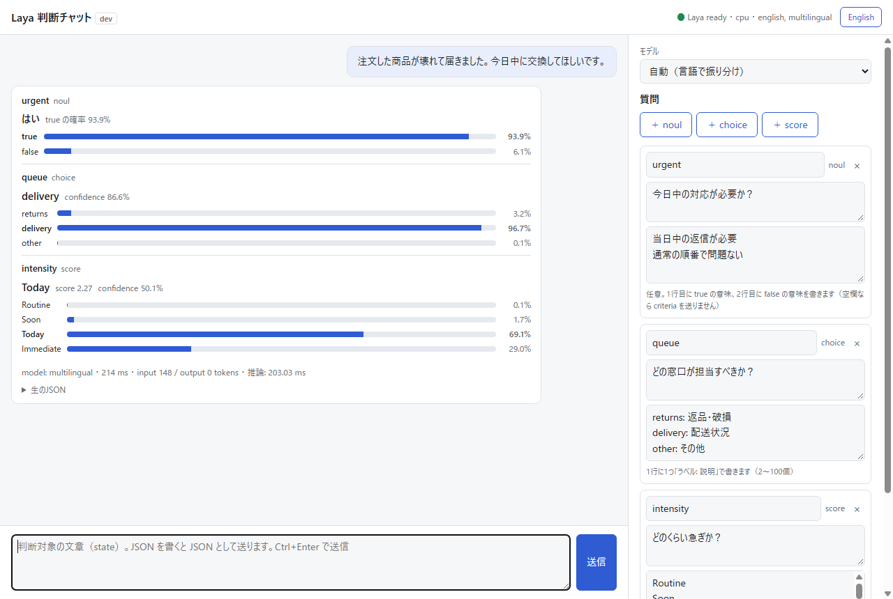

# Laya 検証のための Docker コンテナ

**日本語** | [English](README.en.md)

オープンソースの判断モデル [Laya](https://github.com/NandhaKishorM/laya)（Apache-2.0）を手元の Docker で動かし、試すためのコンテナ一式。
Laya 本体（公式パッケージ `laya[serve]` の `laya-serve`）に、署名で認証する API と、ブラウザで試せる判断チャットを組み合わせている。

> [!NOTE]
> このリポジトリは Laya の作者・公式プロジェクトとは関係のない、非公式の検証環境です。



## できること

- `docker compose up` 1回で Laya を起動する（既定は NVIDIA GPU。CPU にも切り替えられる）
- ブラウザの判断チャットで、文章と質問（はい/いいえ・選択・段階評価）を入れて Laya の判断を確かめる
- 外部のアプリケーションから、HMAC 署名付きの HTTP API として Laya を呼ぶ

## ドキュメント

| ドキュメント | 内容 |
|---|---|
| [Docker コンテナ展開手順](docs/ja/deploy.md) | 前提、起動、GPU と CPU の切り替え、停止と更新、設定一覧、トラブルシューティング |
| [チャットの使い方](docs/ja/chat.md) | 画面の構成、質問の作り方、結果の読み方 |
| [API 利用手順（外部アプリから使う）](docs/ja/api.md) | サンプルクライアント（Node.js / Python）、エンドポイント、リクエストと応答の形式、エラー |
| [認証仕様](docs/ja/auth.md) | HMAC 署名 + nonce の仕様と、curl での呼び方 |

開発記録（日本語のみ）: [決定事項](docs/decisions.md) ・ [ポート台帳](docs/port-registry.md) ・ [誹謗中傷判定の検証](docs/defamation-eval.md)

## クイックスタート

Docker（Compose v2.24 以上）があればよい。GPU がないときは [展開手順の3](docs/ja/deploy.md#3-gpu-か-cpu-かを決める) で CPU に切り替えてから起動する。

```sh
git clone https://github.com/polites-co-jp/laya-api.git
cd laya-api/laya-api-containers
cp .env.example .env
# .env の API_AUTH_SECRET に32文字以上のランダムな文字列を入れる（例: openssl rand -base64 32）
docker compose up -d --build
```

| 開くもの | URL |
|---|---|
| 判断チャット | <http://127.0.0.1:22301> |
| API | <http://127.0.0.1:22300> |

初回は Laya の重み（約1.5GB）を Hugging Face から取得するため、使えるようになるまで数分かかる。

## 構成

```
ブラウザ ──> chat :22301 ──(署名して中継)──┐
外部アプリ ──(HMAC 署名)────────────────> api :22300 ──> laya :8000（ホストには非公開）
```

| パス | 内容 |
|---|---|
| [apps/laya](apps/laya) | Laya 本体のイメージ（`laya[serve]==0.3.28`。torch は CUDA 版と CPU 版を切り替え） |
| [apps/api](apps/api) | 署名を検証して Laya へ中継する API（Node.js / Fastify / TypeScript） |
| [apps/chat](apps/chat) | 動作確認用の判断チャット（日本語 / English） |
| [apps/examples](apps/examples) | 外部アプリ向けのサンプルクライアント（Node.js / Python、依存なし） |
| [apps/defamation-eval](apps/defamation-eval) | 掲示板・SNS の投稿で誹謗中傷判定を試す検証スクリプト（Python、依存なし） |
| [laya-api-containers](laya-api-containers) | docker compose 一式と `.env.example` |
| [docs](docs) | 手順書（`ja/`・`en/`）、スクリーンショット、開発記録 |

## 開発

API とチャットのテストは各アプリのディレクトリで実行する（Node.js 22 以上）。

```sh
cd apps/api   # または apps/chat
npm ci
npm run typecheck
npm test
```

## ライセンス

[Apache License 2.0](LICENSE)。
Laya 本体と重みは、それぞれの配布元（[NandhaKishorM/laya](https://github.com/NandhaKishorM/laya)、Hugging Face の `convaiinnovations/laya*`）のライセンスに従う。
